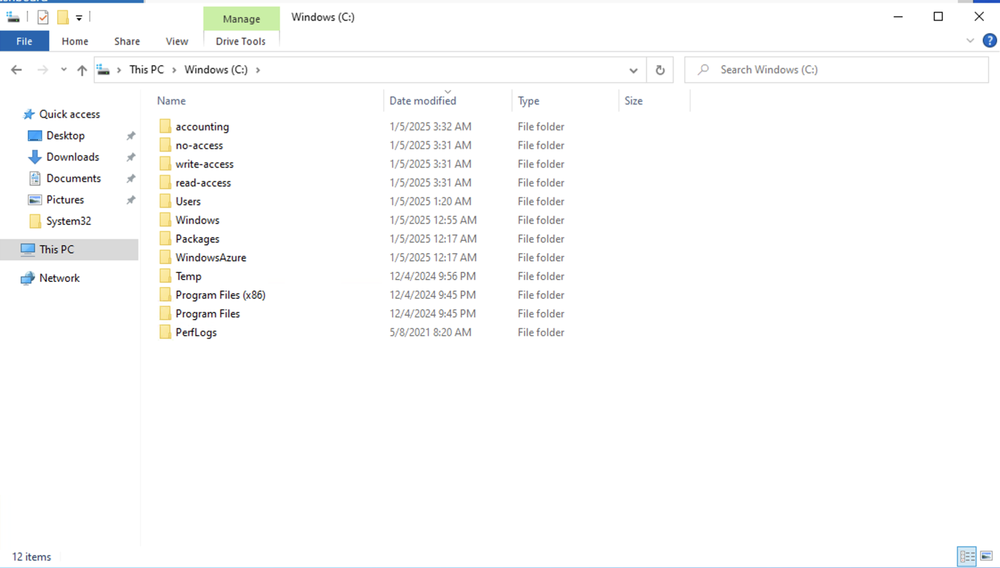
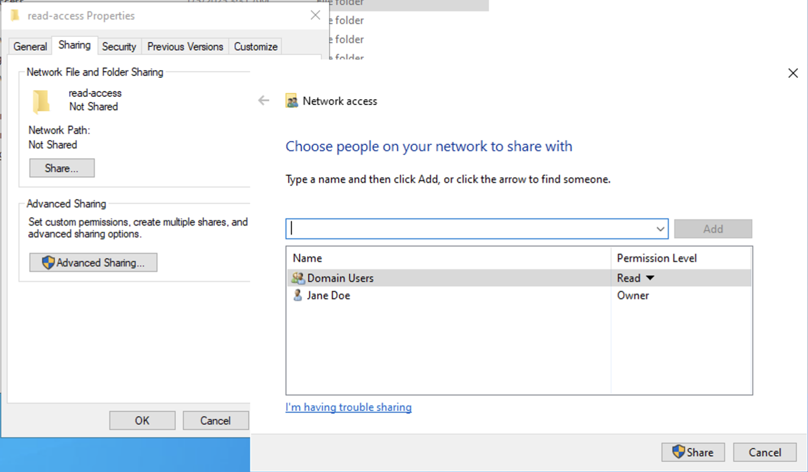
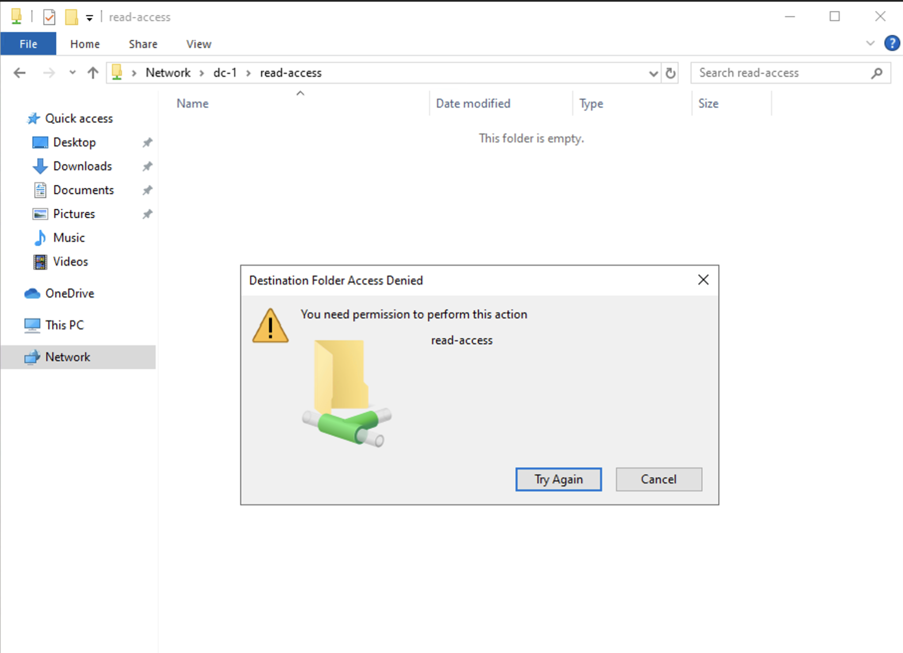
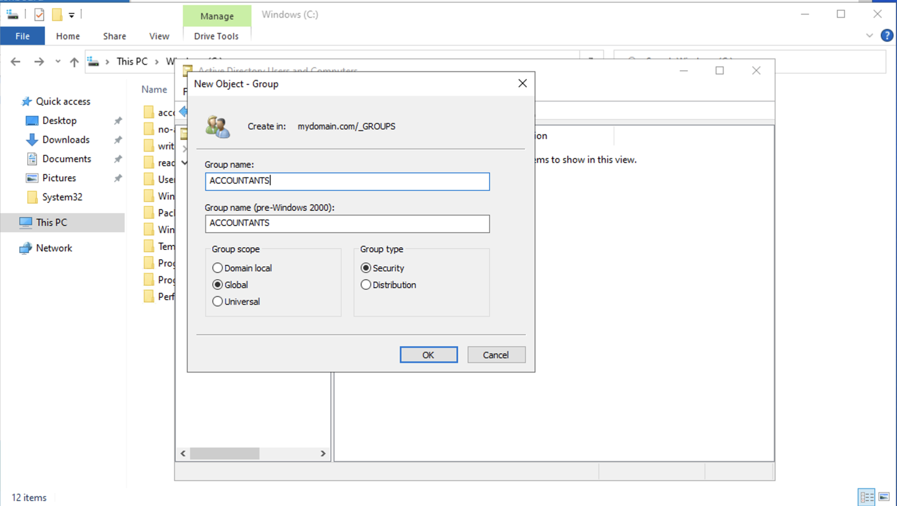
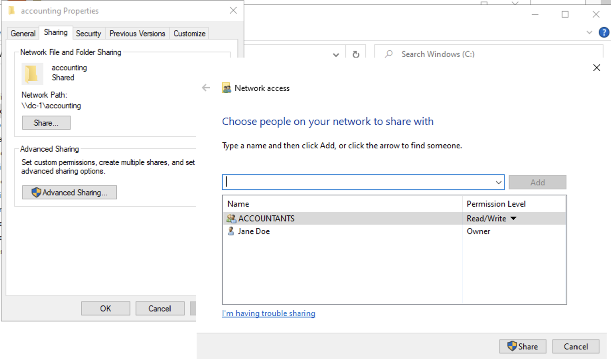
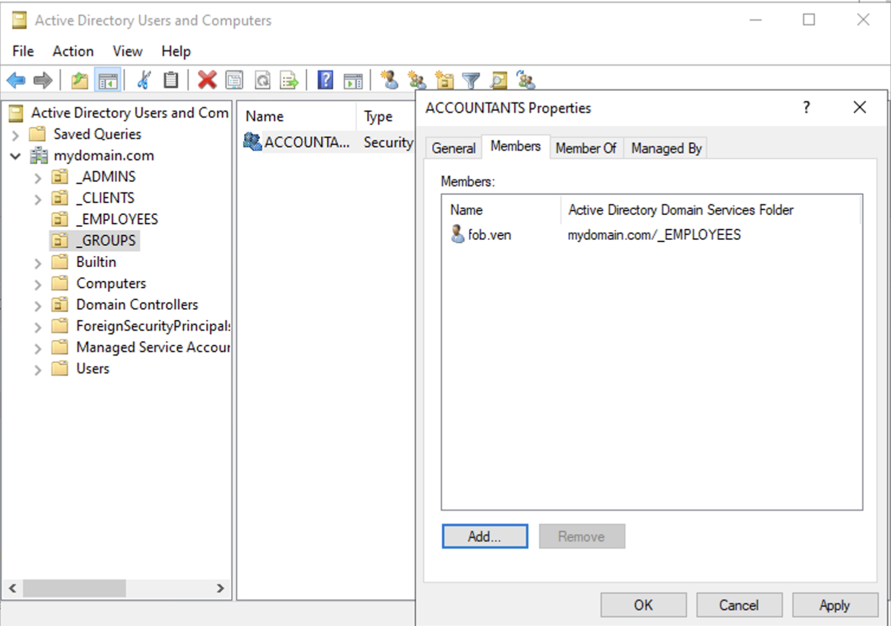
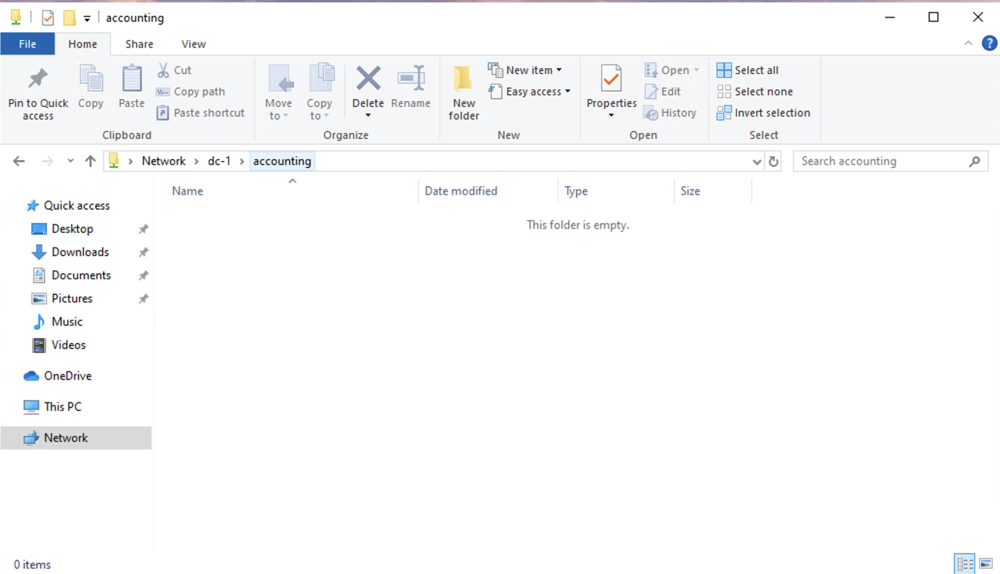

# Configuring File Shares and Permissions in Active Directory

## Objective:
This lab will create file shares with various permissions, test access to the shares as a normal user, and use Active Directory groups to control access to specific resources.

---

## 1. Connect/Log into DC-1 as Domain Admin

- **Login to DC-1** using your domain admin account:
  - Username: `mydomain.com\jane_admin`
  - Password: `Cyberlab123!`

---

## 2. Connect/Log into Client-1 as a Normal User

- **Login to Client-1** using a regular user account:
  - Username: `mydomain.com\<someuser>`
  - Password: `Cyberlab123!`

---

## 3. Create Folders on DC-1

- On **DC-1**, navigate to the **C:\** drive and create the following 4 folders:
  - `read-access`
  - `write-access`
  - `no-access`
  - `accounting` (skip permissions for this folder for now)
 

---

## 4. Set Folder Permissions and Share the Folders

- Set the following folder permissions and share the folders:

  - **Folder**: `read-access`
    - **Group**: `Domain Users`
    - **Permission**: `Read`

  - **Folder**: `write-access`
    - **Group**: `Domain Users`
    - **Permission**: `Read/Write`

  - **Folder**: `no-access`
    - **Group**: `Domain Admins`
    - **Permission**: `Read/Write`
   

  - **Folder**: `accounting` (skip for now)

---

## 5. Attempt to Access File Shares as a Normal User

- On **Client-1**, open the **Run** dialog (`Start` → `Run`), and enter `\\dc-1`.
- Try accessing the folders you just created:
  - Which folders can you access?
  - Which folders can you create files in?
  - Does the behavior match the permissions you set?

---

## 6. Create an "ACCOUNTANTS" Security Group in Active Directory

- On **DC-1**, open **Active Directory Users and Computers** (ADUC).
- Create a new security group called **ACCOUNTANTS**.

---

## 7. Assign Permissions to the "Accounting" Folder

- On **DC-1**, navigate to the **accounting** folder you created earlier.
- Set the following permissions:
  - **Folder**: `accounting`
  - **Group**: `ACCOUNTANTS`
  - **Permission**: `Read/Write`
 

---

## 8. Test Access to the "Accounting" Folder

- On **Client-1**, as `<someuser>`, attempt to access the **accounting** folder via `\\DC-1\accounting`.
  - **Expected Result**: Access should be denied.

---

## 9. Add `<someuser>` to the "ACCOUNTANTS" Security Group

- On **DC-1**, add `<someuser>` to the **ACCOUNTANTS** security group.

---

## 10. Re-login to Client-1 and Test Access

- On **Client-1**, log out of `<someuser>`'s session.
- Log back in as `<someuser>`.
- Attempt to access the **accounting** folder again via `\\DC-1\accounting`.
  - **Expected Result**: Access should now be granted, as the user is a member of the **ACCOUNTANTS** security group.
 

